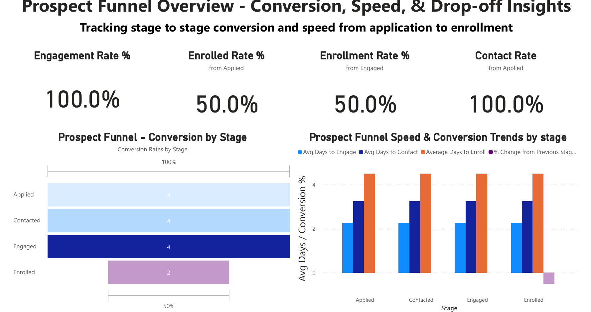

# 📊 Prospect Funnel Optimization Dashboard

> **“Tracking stage-to-stage conversion and speed from application to enrollment.”**  
> Designed to uncover drop-off points and optimize outreach timing within the applicant journey.

---

## 📌 Project Overview

This dashboard analyzes the **prospect-to-enrollment funnel** for an education or service-based organization. It highlights where potential candidates drop off and how quickly they move between stages. By tracking **conversion rates** and **average time-to-contact/engage/enroll**, this solution enables leaders to:

- Identify bottlenecks and sharp drop-off points  
- Evaluate team response times  
- Improve engagement and enrollment strategies  

---

## 🧩 Key Metrics Tracked

| Metric                           | Description                                                                 |
|----------------------------------|-----------------------------------------------------------------------------|
| **Engagement Rate %**            | % of prospects contacted or engaged after applying                          |
| **Enrolled Rate % (from Applied)** | % of total applied prospects who successfully enrolled                     |
| **Enrolled Rate % (from Engaged)** | % of engaged prospects who enrolled                                        |
| **Contact Rate % (from Applied)** | % of prospects contacted compared to total applied                         |
| **% Change from Previous Stage** | Measures stage-to-stage drop-off or gain (e.g., -50% from Engaged to Enrolled) |
| **Avg Days to Contact**          | Avg. number of days from apply date to first contact attempt                |
| **Avg Days to Engage**           | Avg. number of days until prospect is fully engaged in conversation         |
| **Avg Days to Enroll**           | Avg. number of days from apply to enrollment                                |

---

## 🔍 Insights Uncovered

- 📉 **50% drop-off** from *Engaged* to *Enrolled* stage signals a need to investigate post-engagement support or friction.
- ⚡ **Quick engagement & contact speeds** (~2–3 days) across stages indicate strong initial outreach.
- 🔁 Engagement consistency suggests repeatable workflows are in place—but final conversion may require targeted follow-up or better qualification.

---

## 🛠️ Tools Used

- **Power BI**: Interactive visualizations, tooltips, and DAX measures  
- **DAX**: Custom calculations for % drop, average day metrics, and dynamic tooltips  
- **Power Query**: Data cleaning and shaping (source not shown in this snapshot)  
- **Excel**: Initial stage-to-stage data organization  

---

## 🧠 Skills Demonstrated

- Funnel conversion analysis  
- KPI creation and tooltip customization  
- Visual storytelling and layout design  
- Dashboard interactivity using calculated measures  
- Business questions translated into actionable insights  

---

## 📁 Folder Structure

Prospect-Funnel-Optimization-Dashboard/
│
├── visuals/
│ └── Screenshot_Prospect_Funnel_Overview.png
├── README.md
└── (Optional: Power BI file if shared publicly)

---

## 💼 Author

**Oscar Holguin**  
Former Soldier → Data Analyst | Power BI • SQL • Python  
🔗 [LinkedIn](https://www.linkedin.com/in/yashuasspear-oscar-holguin-silva/)  
🏷️ #SoldiersInTech

---

