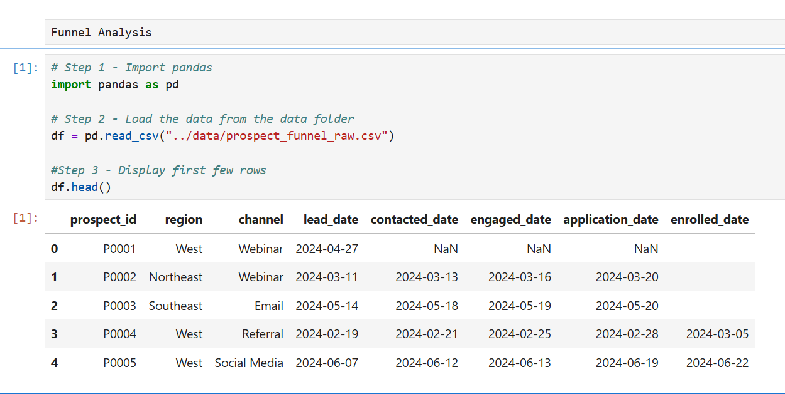
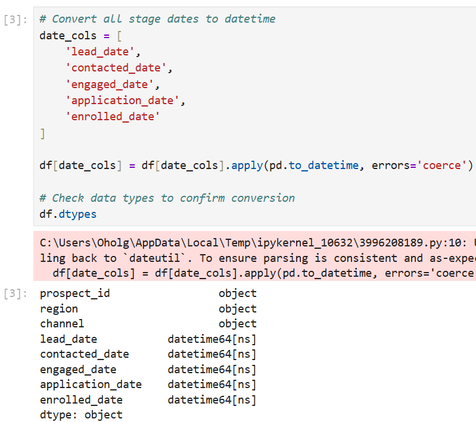
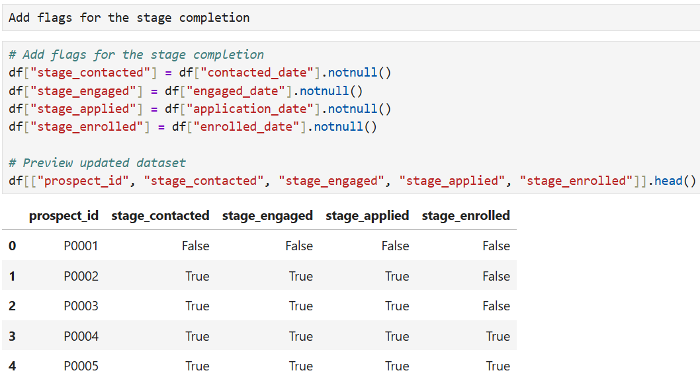
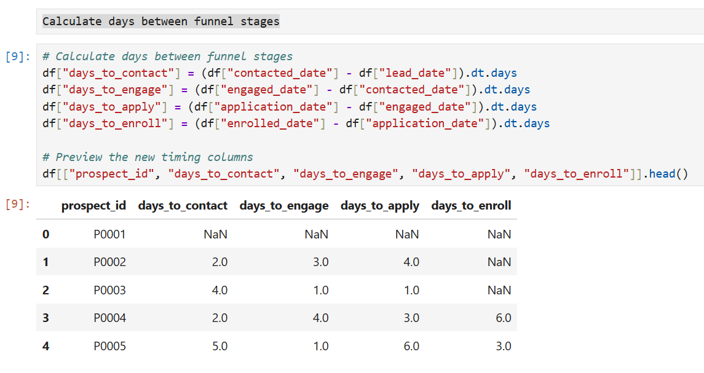
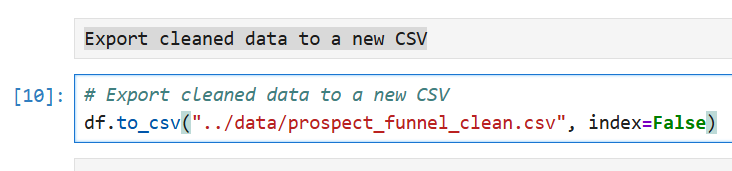

# 📊 Prospect Funnel Optimization Dashboard

> **“Tracking stage-to-stage conversion and speed from application to enrollment.”**  
> Designed to uncover drop-off points and optimize outreach timing within the applicant journey.

---

## 📌 Project Overview

This dashboard analyzes the **prospect-to-enrollment funnel** for an education or service-based organization. It highlights where potential candidates drop off and how quickly they move between stages. By tracking **conversion rates** and **average time-to-contact/engage/enroll**, this solution enables leaders to:

- Identify bottlenecks and sharp drop-off points  
- Evaluate team response times  
- Improve engagement and enrollment strategies  

---

## 🧩 Key Metrics Tracked

| Metric                           | Description                                                                 |
|----------------------------------|-----------------------------------------------------------------------------|
| **Engagement Rate %**            | % of prospects contacted or engaged after applying                          |
| **Enrolled Rate % (from Applied)** | % of total applied prospects who successfully enrolled                     |
| **Enrolled Rate % (from Engaged)** | % of engaged prospects who enrolled                                        |
| **Contact Rate % (from Applied)** | % of prospects contacted compared to total applied                         |
| **% Change from Previous Stage** | Measures stage-to-stage drop-off or gain (e.g., -50% from Engaged to Enrolled) |
| **Avg Days to Contact**          | Avg. number of days from apply date to first contact attempt                |
| **Avg Days to Engage**           | Avg. number of days until prospect is fully engaged in conversation         |
| **Avg Days to Enroll**           | Avg. number of days from apply to enrollment                                |

---

## 🔄 Project Workflow (Python + Jupyter)

Data wrangling was done using Python (pandas) inside a Jupyter notebook to prepare the funnel dataset for Power BI. Below are the core preprocessing steps:

### 🧪 Step 1: Load and Preview Raw Data  

### 📆 Step 2: Convert Stage Dates to Datetime  

### ✅ Step 3: Create Stage Completion Flags  

### ⏱️ Step 4: Calculate Stage Duration Metrics  

### 💾 Step 5: Export Cleaned Data to CSV  

---

## 📊 Dashboard Tools Used

- **Power BI**: Interactive visualizations, tooltips, and DAX measures  
- **DAX**: Custom calculations for % drop, average day metrics, and dynamic tooltips  
- **Power Query**: Data cleaning and shaping  
- **Excel**: Initial stage-to-stage layout  
- **Python (Jupyter Notebook)**: Data preprocessing pipeline

---

## 🧠 Skills Demonstrated

- Funnel conversion analysis  
- Python-based data wrangling  
- KPI creation and tooltip customization  
- Dashboard storytelling and layout design  
- Power BI interactivity using calculated measures  
- Business questions translated into actionable insights  

---

## 📁 Folder Structure

Prospect-Funnel-Optimization-Dashboard/
│
├── data/
│ ├── prospect_funnel_raw.csv
│ └── prospect_funnel_clean.csv
│
├── notebooks/
│ └── funnel_analysis.ipynb
│
├── PowerBI/
│ └── (Power BI .pbix file if shared)
│
├── visuals/
│ ├── Screenshot_Prospect_Funnel_Overview.png
│ ├── step1_load_raw_data_preview.png
│ ├── step2_convert_dates_to_datetime.png
│ ├── step3_create_stage_flags.png
│ ├── step4_calculate_stage_durations.png
│ └── step5_export_clean_data.png
│
└── README.md

---

## 💼 Author

**Oscar Holguin Silva**  
Former Soldier → Data Analyst | Power BI • SQL • Python  
🔗 [LinkedIn](https://www.linkedin.com/in/yashuasspear-oscar-holguin-silva/)  
🏷️ #SoldiersInTech

---

## 🧠 Next Steps

- Add predictive scoring or segmentation
- Integrate outreach team metrics for performance tracking
- Deploy in a Streamlit app for self-serve interaction

